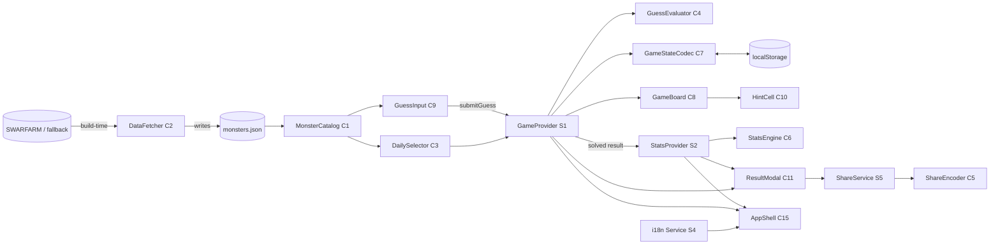

# Component Dependencies & Data Flow — Smwdle

## Dependency Matrix (→ = "depends on / calls")

| Component | Depends on |
|-----------|-----------|
| DataFetcher (C2) | External source (SWARFARM/fallback) → writes monsters.json |
| MonsterCatalog (C1) | monsters.json |
| DailySelector (C3) | MonsterCatalog (answer pool) |
| GuessEvaluator (C4) | Monster type only (pure) |
| ShareEncoder (C5) | GameResult type only (pure) |
| StatsEngine (C6) | Stats/GameResult types (pure) |
| GameStateCodec (C7) | PersistedState types (pure) |
| GameProvider/useGame (S1) | C1, C3, C4, C7, Persistence (S3) |
| StatsProvider/useStats (S2) | C6, S3 |
| PersistenceService (S3) | C7, localStorage |
| ShareService (S5) | C5, Clipboard API |
| GameBoard (C8) | GuessResult data (from S1) |
| GuessInput (C9) | C1 (candidates), S1 (submit) |
| HintCell (C10) | AttributeResult data |
| ResultModal (C11) | S1 (result), S2 (stats), S5 (share), C1 (portrait) |
| StatsPanel (C12) | S2 |
| LanguageToggle (C13) | S4 |
| AppShell (C15) | S1, S2, S4 providers |

## Data Flow Diagram

## Communication Patterns
- **Build-time vs runtime boundary**: C2 runs offline and produces static JSON; the browser never calls SWARFARM at runtime (performance + resilience + licensing safety).
- **Pure core, effectful shell**: U1 (C1, C3–C7) are pure/deterministic → directly unit- and property-testable. Side effects (storage, clipboard, DOM) live only in U2 services/components.
- **Unidirectional data**: providers hold state; components receive props and emit events upward.
