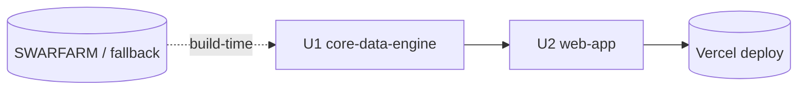

# Unit Dependency Matrix — Smwdle

## Dependencies
| Unit | Depends on | Nature |
|------|-----------|--------|
| U1 core-data-engine | External source (build-time only, via DataFetcher) | Build-time only; no runtime dependency |
| U2 web-app | U1 (imports pure logic + `monsters.json`) | Compile/runtime (in-process import) |

## Build / Construction Order
1. **U1 first** — establish schema, catalog, and pure logic (with tests). U2 has nothing to wire without it.
2. **U2 second** — build UI + services on top of U1.

## Coordination Notes
- **Contract between units**: the `types.ts` interfaces (`Monster`, `GuessResult`, `Stats`, `PersistedState`) and the `monsters.json` schema. Keep these stable; U2 depends only on these.
- **No circular dependency**: U1 never imports from U2.
- **Parallelization**: limited (single dev, U2 needs U1's contract); U1's pure functions and U2's static UI shell could be scaffolded in parallel once `types.ts` is fixed.
- **Rollback**: independent commits per unit; static deploy is trivially revertible.
