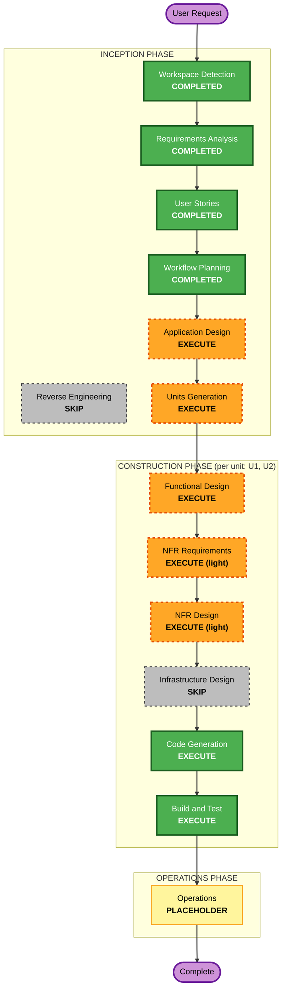

# Execution Plan — Smwdle

## Detailed Analysis Summary

### Change Impact Assessment
- **User-facing changes**: Yes — the entire product is a new player-facing game.
- **Structural changes**: Yes — greenfield architecture (data pipeline + pure game logic + Next.js UI).
- **Data model changes**: Yes — a new Monster schema and cached JSON catalog.
- **API changes**: No server API — static site; a build-time data-fetch script only.
- **NFR impact**: Yes — performance (static/cached), accessibility (color-independent hints, keyboard nav), i18n (EN/Thai).

### Risk Assessment
- **Risk Level**: **Low**
- **Rollback Complexity**: Easy (static site, no production data, versioned deploys on Vercel).
- **Testing Complexity**: Moderate (pure logic is highly testable; main external unknown = SWARFARM data availability/licensing → fallback to manually curated JSON).

## Proposed Unit Decomposition (2 units)

| Unit | Scope | Notes |
|------|-------|-------|
| **U1 — core-data-engine** | Monster schema; SWARFARM fetch/transform build script; cached JSON catalog + curated answer pool; **pure game logic**: deterministic daily selection, 7-attribute comparison, spoiler-free share encoding, stats + game-state serialization. | PBT-relevant unit (comparison invariants, serialization round-trips). |
| **U2 — web-app** | Next.js + TS + Tailwind UI: board, autocomplete guess input, hint rows, win/share modal, stats panel, footer/attribution; **EN/Thai i18n**; localStorage wiring; portrait rendering with placeholders. | Depends on U1's logic + data. |

## Workflow Visualization

## Phases to Execute

### 🔵 INCEPTION PHASE
- [x] Workspace Detection (COMPLETED)
- [x] Reverse Engineering (SKIPPED — greenfield)
- [x] Requirements Analysis (COMPLETED)
- [x] User Stories (COMPLETED)
- [x] Workflow Planning (IN PROGRESS)
- [ ] Application Design — **EXECUTE**
  - **Rationale**: New system; module boundaries, component methods, and the attribute-comparison business rules need explicit definition.
- [ ] Units Generation — **EXECUTE**
  - **Rationale**: Clean split into core-data-engine (U1) and web-app (U2) gives a manageable per-unit construction loop and isolates the PBT-heavy logic.

### 🟢 CONSTRUCTION PHASE (per unit)
- [ ] Functional Design — **EXECUTE**
  - **Rationale**: Monster schema, deterministic selection, comparison rules, and serialization need designing; drives PBT-01 property identification.
- [ ] NFR Requirements — **EXECUTE (light)**
  - **Rationale**: Performance targets, accessibility, i18n, and PBT framework selection (fast-check, PBT-09).
- [ ] NFR Design — **EXECUTE (light)**
  - **Rationale**: Translate those NFRs into concrete patterns (a11y hint redundancy, static caching, i18n structure).
- [ ] Infrastructure Design — **SKIP**
  - **Rationale**: No cloud/backend resources; static site on Vercel. Deploy/config folded into Build and Test.
- [ ] Code Generation — **EXECUTE (ALWAYS)**
  - **Rationale**: Implementation of both units.
- [ ] Build and Test — **EXECUTE (ALWAYS)**
  - **Rationale**: Build, unit + property-based tests, integration, and run verification; includes Vercel deploy config.

### 🟡 OPERATIONS PHASE
- [ ] Operations — PLACEHOLDER

## Estimated Timeline
- **Total active stages**: Application Design + Units Generation + (Functional Design → NFR Req → NFR Design → Code Gen) × 2 units + Build and Test.
- **Estimated Duration**: Iterative across this session with approval gates; each stage is a focused pass.

## Success Criteria
- **Primary Goal**: A working, deployable daily Summoners War monster-guessing web game (Classic mode).
- **Key Deliverables**: Monster JSON catalog + curated pool; pure, tested game-logic library; Next.js UI with EN/Thai i18n, sharing, and localStorage stats.
- **Quality Gates**: Correct 7-attribute comparison (example + property-based tests), deterministic daily selection, spoiler-free share, accessible color-independent hints, green build and passing tests.
